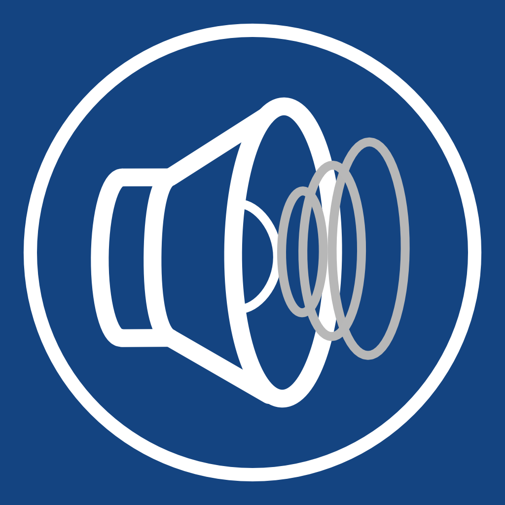

SpeedPitch
==========

Copyright (c) [Dan Wilcox](danomatika.com) 2021

BSD Simplified License.

For information on usage and redistribution, and for a DISCLAIMER OF ALL
WARRANTIES, see the file, "LICENSE.txt," in this distribution.

This project has been developed as part of the Nix Wie Raus! Fahrrad Kunst Sommer exhibition, Karlsruhe Germany 2021.

Description
-----------

_SpeedPitch_ is a simple augmented sonic reality experiment that alters music playback speed based on your actual GPS ground speed. The faster you go, the higher the pitch and sudden stops lead to dragging audio samples. Natural motion leads to unnatural sound.

User Guide
----------

### Usage

1. Select files from the Music app or Files browser using the buttons in the main screen, upper right
2. Start playback via pressing play or tapping a song in the playlist screen
3. Ride you bike or take a walk and see what happens...

### Speed

You can adjust the speed limit for the pitch processing to set the speed songs are played back at a normal rate: menu button, upper right -> Speed. The speed ranges approximate the type of movement you will be doing based on the vehicle.

### Quantization

Additionally, the playback rate calculation from the live speed updates can be quantized. This basically changes the rate in discrete steps instead of a smooth range which makes matching speed between multiple people much easier.

### Keep Awake

Live speed calculations require navigation-level GPS updates which only ocurr when the device is in active use. If the screen turns off, GPS updates to SpeedPitch will be paused therefore, by default, the "Keep screen awake" Display setting is set to on.

Acknowledgments
---------------

This project has been developed as part of the Nix Wie Raus! Fahrrad Kunst Sommer exhibition, Karlsruhe Germany 2021.

https://www.bbk-karlsruhe.de/fahrrad-kunst-sommer/
